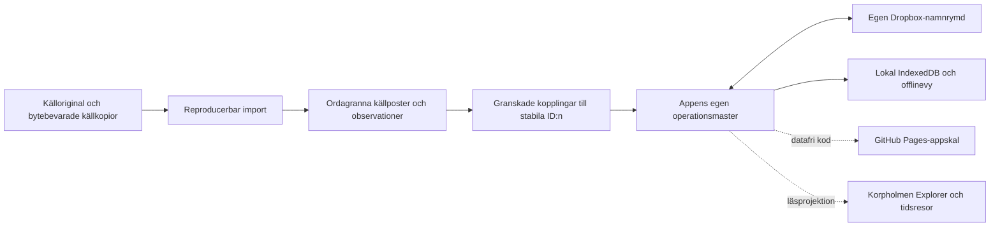
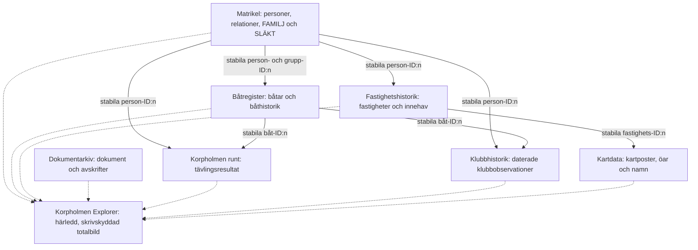
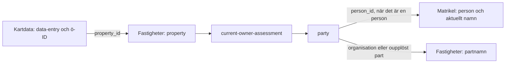
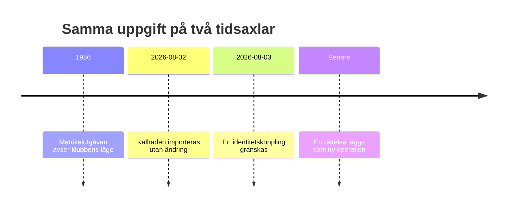
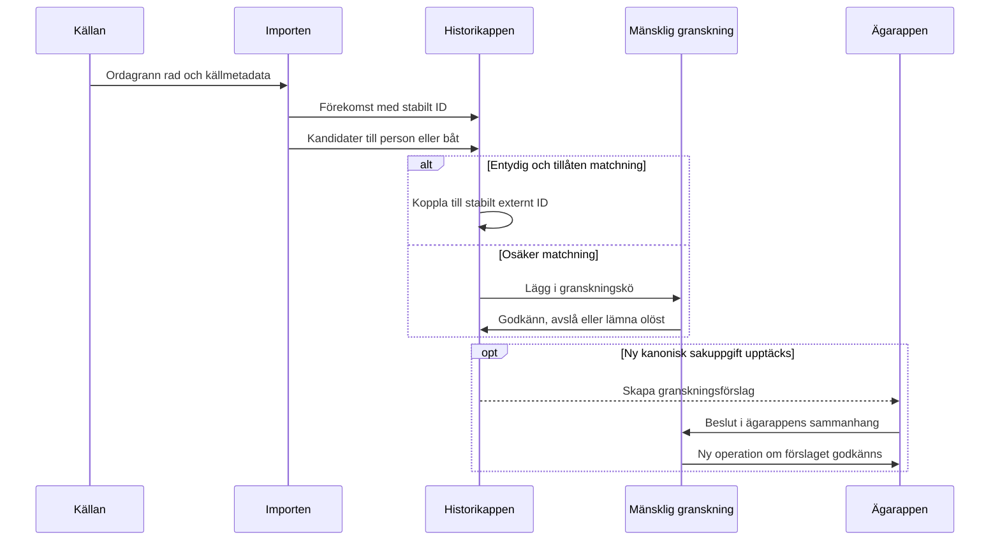
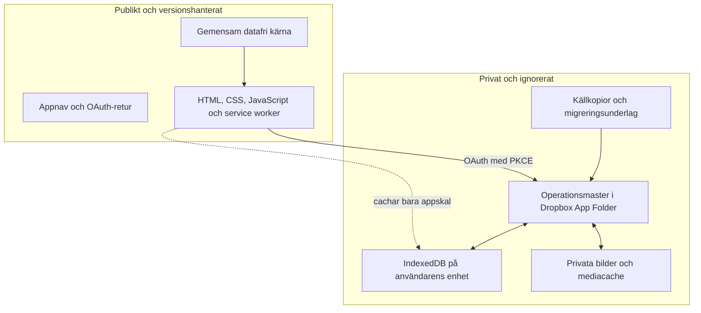

# Korpholmens apparkitektur

Detta är det normerande arkitekturdokumentet för Korpholmens appar. Det
beskriver den avsedda ansvarsfördelningen även när alla delar ännu inte är
byggda. Appspecifika datamodeller får precisera dokumentet men inte skapa en
andra master för samma sorts sakuppgift.

## Grundidé

Appfamiljen består av en installerbar PWA, sju avgränsade ägar- och
granskningsappar, en gemensam datafri motor och en framtida sammanhållen
läsvy. Original, tolkning och presentation är skilda lager.



Fyra regler håller modellen samman:

1. En saktyp har en utpekad ägarapp.
2. Andra appar lagrar stabila ID:n och läser namn och nuläge skrivskyddat från ägarmastern. En lokal cache är aldrig en andra master.
3. Källans ordalydelse skrivs aldrig över av normalisering eller rättelse.
4. En härledd vy får inte skriva tillbaka ett nytt faktum till någon master.

## Vilken app äger vad?

| App | Kanoniskt ansvar | Refererar till | Äger inte |
|---|---|---|---|
| **Matrikel** | Stabil personidentitet för både klubb-/släktpersoner och externa personer, verkliga personnamn och namnhistorik, personrelationer, medlemsidentitet, FAMILJ och SLÄKT | Fastigheter och båtar för navigation | Juridiskt ägande, båtar eller en matrikelutgåvas exakta stavning |
| **Båtregister** | Stabil båtidentitet, båtnamn och båthistorik, motorer, bilder samt belagda typade båtanknytningar | Person-, familje-, släkt- och fastighets-ID:n | Personidentitet eller medlemsstatus |
| **Fastighetshistorik** | Fastigheter, historiska jordenheter, innehav, bruk, transaktioner, datumroller, källor och evidens | Person-ID:n | Släktskap eller juridiskt ägande härlett ur fastighetsgemenskap |
| **Dokumentarkiv** | Dokumentidentitet, ordagrann avskrift och dokumentets granskade registerkopplingar | Alla relevanta entitets-ID:n | Person-, båt- eller fastighetssanning som bara råkar nämnas i texten |
| **Korpholmen runt** | Tävlingsutgåvor, resultat, tider, klasser och källrader | Person- och båt-ID:n | Personer och båtar som egna masterobjekt |
| **Klubbhistorik** | Daterade matrikelutgåvor, medlemsobservationer, historiska klubbnamnsformer, roller när de är källbelagda, båtförekomster och belagda ägarobservationer | Person-, båt- och senare fastighets-ID:n | Stabil person-/båtidentitet eller ägande härlett ur kolumnplacering |
| **Kartdata** | Aktiv kartdata, stabila öobjekt, namnformer samt strukturerade ö- och fastighetskopplingar | Fastighets-ID:n, Matrikel-personer och externa ägarparter från Fastighetshistorik | Ägarhistorik, personidentitet eller AI-förslag som aktiva sakuppgifter |

`packages/core/` äger ingen sakdata. Paketet tillhandahåller operationer,
materialisering, IndexedDB, synk, OAuth och konfliktregler.

## Mastrar, skrivskyddade läsningar och den gemensamma läsvyn

En app lagrar bara det främmande stabila ID som behövs för länken. Vid läsning
hämtas den andra mastern med en särskild skrivskyddad läsare. Läsaren får inte
skapa mappar, ladda upp operationer eller blanda främmande operationer med
appens egen logg. Den sparar en versionsbar lokal snapshot för offlineläge.

Äldre `person-ref`, `property-ref`, `external-party` och
`property-owner-link` ligger kvar som migrationsfallback. När ägarmastern har
lästs används aldrig deras kopierade namn eller ägaruppgifter. De ska fasas ut
först när alla befintliga ID-länkar har jämförts och förlustkontrollen är grön.



Explorer ska alltså vara en materialiserad läsmodell, inte ytterligare en
sakmaster. Den ska kunna visa en person, familj, båt, fastighet, handling eller
händelse och följa länkarna mellan dem. Ett tidsfilter väljer observationer
och giltighetsintervall från rätt master.

Kartdata v2 använder `data-entry` som aktiv sakpost. Posten länkas till ett
stabilt ö-ID genom `data-entry-island-link` och till Fastighetshistorikens
fastighets-ID genom `data-entry-property-link`. Äldre `map-entry`, källfält,
arbetsanteckningar och automatiska förslag ligger kvar som ett avskilt
append-only-arkiv men läses inte av appen och ingår inte i exporten.

Önamn ligger som separata `name-record`, så att föredraget, officiellt,
historiskt och alternativt namn kan samexistera utan att ö-ID:t byts. En
sakpost kopplas bara till en ö när länken är entydig. Borttagna öar och
områdeskategorier får ingen gissad ersättningsö.

Kartdata kopierar inte det äldre fritextfältet för dagens ägare. För varje
länkad fastighet läser appen live eller ur en märkt offlinecache det granskade
`current-owner-assessment`-lagret från Fastighetshistorik. Därifrån följs
`owner_party_ids` till en part. Har parten `person_id` hämtas namnet från
Matrikel; organisationer och ännu oupplösta namngrupper visas från
Fastigheter. Namnlikhet används aldrig för identitetsmatchning.



Ett namnbyte görs alltså en gång i Matrikel. Båtregister, Fastigheter,
Kartdata, Klubbhistorik och Korpholmen runt får det nya namnet vid nästa
skrivskyddade lässynk. Källans rånamn och historiska namnformer påverkas inte.

## Tre lager av namn

Namn får inte blandas ihop bara för att de liknar varandra.

| Lager | Exempel | Ägare |
|---|---|---|
| Källform | `Christina Lindbom` på ett matrikelblad | Klubbhistorik eller Dokumentarkiv, ordagrant |
| Identitetskoppling | Källraden avser personen `christinakisselindblom` | Granskat beslut i den importerande appen |
| Verkligt namn och namnhändelse | Une → Lindblom efter ett verkligt namnbyte | Matrikel efter godkännande |

Rena skrivfel, OCR-fel och typografiska variationer stannar i källformen och
kan få rättelsemetadata. De blir inte en namnhändelse. Ett verkligt namnbyte
kan upptäckas i Klubbhistorik men lämnas som förslag tills Matrikelns master
har godkänt det.

Klubbhistorik skiljer dessutom källtext från källayout. Ett särskilt
`source-layout-row` kan placera flera båtrader bredvid en medlemsrad eller
återge rubriker och noter utan att skapa en person–båt-relation. En tryckt rad
med flera namngivna personer delas i personförekomster, medan en ren
familjeetikett bevaras som grupptext.

### När ett tidigare godkännande visar sig vara fel

Ett mänskligt godkännande är ett granskningsbeslut, inte en ofelbar del av
källan. Om senare belägg visar att två personer har slagits ihop felaktigt ska
systemet därför:

1. behålla de ordagranna källförekomsterna och det äldre beslutet i
   operationshistoriken;
2. återkalla den felaktiga länken med en senare operation eller tombstone;
3. skapa saknad stabil identitet i Matrikel och länka om samtliga
   förekomster i Klubbhistorik och andra refererande appar;
4. rätta verkliga namnbyten separat från identitetsdelningen;
5. testa samtidiga källrader som negativ kontroll, så att de två identiteterna
   inte kan slås ihop igen av en framtida import.

Rättelsen 2026-08-03 är referensfallet: **Peter Neretnieks** och **Peter
Holm** står samtidigt i matriklarna 2020–2025 och ska därför ha skilda
person-ID:n. Det verkliga namnbytet är i stället **Anna Neretnieks → Anna
Holm**. Båtreferenser som uttryckligen skriver »Junior Peter = Peter
Neretnieks« pekas om, medan BossaNova-länken till Peter Holm lämnas orörd.

## Tid är en förstaklassdimension

Apparna skiljer mellan minst två tider:

- **domäntid** — när uppgiften gällde eller när källans ögonblicksbild avser;
- **transaktionstid** — när operationen importerades, granskades eller
  rättades.

Fastighetshistorik skiljer dessutom på datumroller som avtal, tillträde,
ansökan, förrättning och observation. Klubbhistorik skiljer matrikelutgåvans
`as_of` från operationsloggens HLC. Explorer ska filtrera på domäntid och
fortfarande kunna redovisa när tolkningen tillkom.

Fastigheters tidslinje är en skrivskyddad läsprojektion över kedjeordningen.
Ett okänt slut kan visas fram till nästa kartlagda uppgift, men det härledda
visningsslutet får aldrig skrivas tillbaka som faktum. Årtionden bevaras som
intervall, inte som påhittade exakta startår. Tidslinjekort visar bara period,
part och roll. Historiska källor ligger i ett separat hopfällt forskningslager
och ska redovisas med begripliga originalhänvisningar; interna arbetskoder och
nutida register visas inte som publika källor. Nulägesägaren visas som
bekräftad utan källapparat.

Fastighetsgemenskap från Matrikel är endast en huvudsaklig eller senast känd
fastighetsanknytning. Den kan visas långt ned som orientering men får aldrig
omtolkas till juridiskt ägande eller fullständig boendehistorik.



## Från källa till godkänd länk



Ingen app får skriva direkt i en annan apps operationsmapp. Överföring av en
ny kanonisk uppgift sker som ett explicit, granskningsbart förslag.

## Privat data, publicering och synk



Varje sakapp har egen IndexedDB-databas och Dropbox-namnrymd:

```text
/matrikel/ops
/batregister/ops       + /batregister/bilder
/fastigheter/ops
/dokumentarkiv/ops
/korpholmenrunt/ops
/klubbhistorik/ops
/kartdata/ops

/<app>/checkpoints/latest.json   # litet atomiskt manifest, aldrig sakmaster
/<app>/snapshots/<sha256>.snapshot-v3.json.gz
```

Operationsmapparna är den oföränderliga historiken och yttersta
återställningskällan. En checkpoint är en reproducerbar materialisering av
operationsloggens senaste kända tillstånd med vattenmärke per skrivande
enhet. Manifestet publiceras sist och pekar på en innehållsadresserad,
gzip-komprimerad snapshot vars storlek och SHA-256 verifieras före användning.
Den gör att en ny telefon kan läsa ett kompakt nuläge och bara hämta senare
batcher. De flesta appar kan ignorera och bygga om en saknad checkpoint från
operationsloggen. En tom Klubbhistorik fallerar däremot säkert, eftersom dess
fulla revisionslogg är för stor för webbens startväg. Checkpoints får aldrig
användas för att radera eller skriva om historiska batcher.

I appens IndexedDB får det dessutom finnas skrivskyddade snapshots av andra
mastrar. De ligger i snapshot-/metadata-lagret, aldrig i appens `ops`-lager,
och kan därför varken synkas tillbaka eller bli sakmaster av misstag.

Korpholmens rotmanifest har scope över hela appfamiljen. Underapparna får inte
registrera egna installerbara manifest eller egna aktiva service workers.
Rotens gemensamma service worker installerar ett versionsatt, atomärt och
datafritt appskal för alla sju appar. Vid övergång avregistreras äldre
underappsregistreringar.

Dropbox-inloggningen lagras i ett gemensamt lokalt sessionslager och speglas
en gång till de äldre appdatabasernas tokenfält under migreringen. Varje ny
flik får inte öppna alla sju databaser bara för att skriva samma token igen.
OAuth återvänder alltid till Korpholmens rot och skickar därefter användaren
tillbaka till den valda underappen. En inloggning gäller därmed hela den
installerade appen.

När Korpholmen eller en underapp öppnas får en låst bakgrundssynk hämta nya
operationsbatcher till samtliga övriga appdatabaser. Bakgrundssynken är
skrivskyddad mot Dropbox: den får aldrig ladda upp en annan apps lokala kö,
eftersom exempelvis båtbilder måste publiceras före operationer som refererar
till dem. Den aktiva appens vanliga synk ansvarar för uppladdning och därefter
hämtning i sin egen namnrymd. Stora privata bildbestånd hämtas fortsatt av den
berörda appen, inte av totalsynken.

Färskhetskontrollen görs **innanför** flerflikslåset. Om tio flikar öppnas
samtidigt får den första genomföra synken och de övriga ska därefter se den
nya färskhetsmarkören och avstå. Nedladdning sker i små, idempotenta chunkar;
Dropbox-cursorn flyttas först när hela listningssidan är behandlad. Därmed
hålls minnet begränsat utan att ett avbrott kan skapa ett datahål. Nätanrop
och databasöppning har sluttid, gamla databasanslutningar stängs vid
versionsbyte och en avbruten status får inte visas som pågående för alltid.

Bilder ligger utanför operationsloggen. Båtregistrets operationsdata bär
bara strukturerade bildreferenser; originalfilerna ligger under
`/batregister/bilder` och hämtas separat vid behov eller för uttryckligt
offlineläge. Storleken på `ops` är därför inte ett mått på bildarkivets
storlek.

Publiceringsbyggen använder tillåtelselistor och ska stoppa om privat data har
byggts in. Service workern får bara cacha det datafria appskalet.

## Korrigeringar, motsägelser och borttagningar

- En rättelse är en ny operation; en äldre operation ändras inte.
- Borttagning använder tombstone så att ett gammalt synkpaket inte kan
  återuppliva uppgiften.
- Två motsägande källpåståenden får finnas samtidigt som separata anspråk.
- En matchningskandidat är inte en bekräftad länk.
- Frånvaro i en senare matrikel betyder `inte observerad`, inte utträde,
  passivitet eller dödsfall.
- Gruppsynlighet, fastighetsgemenskap och kolumnplacering får aldrig förvandlas
  till personligt ägande utan ett separat källbelägg.

## Utbyggnadsordning

1. Lägg nya källor som bytebevarade kopior med kontrollsumma och proveniens.
2. Bygg om en reproducerbar privat startmaster; skriv inte över den levande
   mastern med en helfil.
3. Låt osäkra identiteter, datum och roller stanna i granskningskö.
4. Lägg godkända beslut som nya operationer i rätt ägarapp.
5. Publicera endast appskalet.
6. Uppdatera Explorers läsprojektion när ägarapparnas scheman är stabila.

Klubbhistoriks fördjupade tids- och källmodell finns i
[`apps/klubbhistorik/ARKITEKTUR.md`](apps/klubbhistorik/ARKITEKTUR.md).
Person-, familje- och släktgränserna beskrivs i
[`FAMILJEMODELL.md`](FAMILJEMODELL.md).
