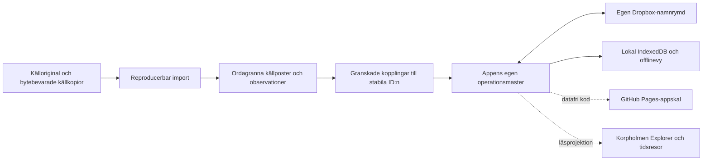
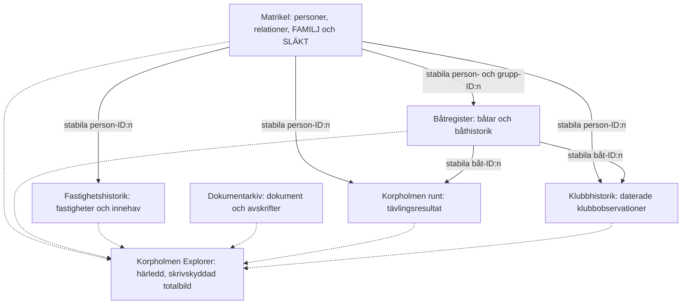
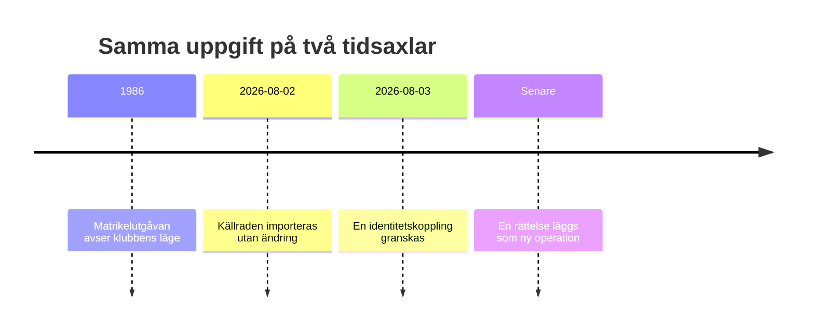
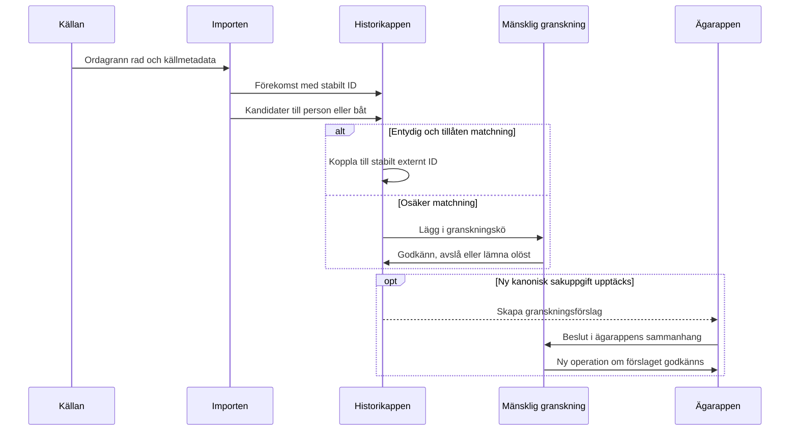
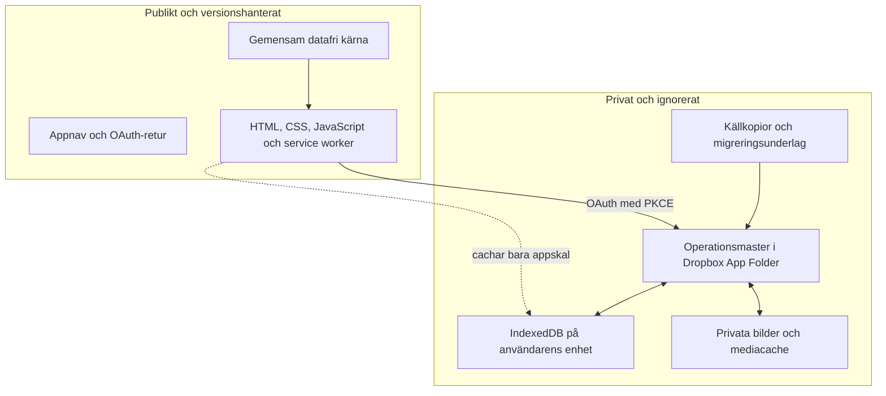

# Korpholmens apparkitektur

Detta är det normerande arkitekturdokumentet för Korpholmens appar. Det
beskriver den avsedda ansvarsfördelningen även när alla delar ännu inte är
byggda. Appspecifika datamodeller får precisera dokumentet men inte skapa en
andra master för samma sorts sakuppgift.

## Grundidé

Appfamiljen består av sex avgränsade sakmastrar, en gemensam datafri motor och
en framtida sammanhållen läsvy. Original, tolkning och presentation är skilda
lager.



Fyra regler håller modellen samman:

1. En saktyp har en utpekad ägarapp.
2. Andra appar länkar med stabila ID:n och får bara ha märkta referenskopior.
3. Källans ordalydelse skrivs aldrig över av normalisering eller rättelse.
4. En härledd vy får inte skriva tillbaka ett nytt faktum till någon master.

## Vilken app äger vad?

| App | Kanoniskt ansvar | Refererar till | Äger inte |
|---|---|---|---|
| **Matrikel** | Stabil personidentitet, verkliga personnamn och namnhistorik, personrelationer, medlemsidentitet, FAMILJ och SLÄKT | Fastigheter och båtar för navigation | Juridiskt ägande, båtar eller en matrikelutgåvas exakta stavning |
| **Båtregister** | Stabil båtidentitet, båtnamn och båthistorik, motorer, bilder samt belagda typade båtanknytningar | Person-, familje-, släkt- och fastighets-ID:n | Personidentitet eller medlemsstatus |
| **Fastighetshistorik** | Fastigheter, historiska jordenheter, innehav, bruk, transaktioner, datumroller, källor och evidens | Person-ID:n | Släktskap eller juridiskt ägande härlett ur fastighetsgemenskap |
| **Dokumentarkiv** | Dokumentidentitet, ordagrann avskrift och dokumentets granskade registerkopplingar | Alla relevanta entitets-ID:n | Person-, båt- eller fastighetssanning som bara råkar nämnas i texten |
| **Korpholmen runt** | Tävlingsutgåvor, resultat, tider, klasser och källrader | Person- och båt-ID:n | Personer och båtar som egna masterobjekt |
| **Klubbhistorik** | Daterade matrikelutgåvor, medlemsobservationer, historiska klubbnamnsformer, roller när de är källbelagda, båtförekomster och belagda ägarobservationer | Person-, båt- och senare fastighets-ID:n | Stabil person-/båtidentitet eller ägande härlett ur kolumnplacering |

`packages/core/` äger ingen sakdata. Paketet tillhandahåller operationer,
materialisering, IndexedDB, synk, OAuth och konfliktregler.

## Mastrar, referenser och den gemensamma läsvyn

En app får läsa en märkt referenskatalog från en annan master för sökning och
länkning. En `person-ref` i Klubbhistorik är därför inte en andra personpost:
`external_id` pekar tillbaka på Matrikelns stabila person. Referensen ska kunna
bytas mot en ny snapshot utan att historiska förekomster ändrar identitet.



Explorer ska alltså vara en materialiserad läsmodell, inte en sjunde
sakmaster. Den ska kunna visa en person, familj, båt, fastighet, handling eller
händelse och följa länkarna mellan dem. Ett tidsfilter väljer observationer
och giltighetsintervall från rätt master.

## Tre lager av namn

Namn får inte blandas ihop bara för att de liknar varandra.

| Lager | Exempel | Ägare |
|---|---|---|
| Källform | `Christina Lindbom` på ett matrikelblad | Klubbhistorik eller Dokumentarkiv, ordagrant |
| Identitetskoppling | Källraden avser personen `christinakisselindblom` | Granskat beslut i den importerande appen |
| Verkligt namn och namnhändelse | Une → Lindblom efter ett verkligt namnbyte | Matrikel efter godkännande |

Rena skrivfel, OCR-fel och typografiska variationer stannar i källformen och
kan få rättelsemetadata. De blir inte en namnhändelse. Ett verkligt namnbyte
kan upptäckas i Klubbhistorik men lämnas som förslag tills Matrikelns master
har godkänt det.

Klubbhistorik skiljer dessutom källtext från källayout. Ett särskilt
`source-layout-row` kan placera flera båtrader bredvid en medlemsrad eller
återge rubriker och noter utan att skapa en person–båt-relation. En tryckt rad
med flera namngivna personer delas i personförekomster, medan en ren
familjeetikett bevaras som grupptext.

## Tid är en förstaklassdimension

Apparna skiljer mellan minst två tider:

- **domäntid** — när uppgiften gällde eller när källans ögonblicksbild avser;
- **transaktionstid** — när operationen importerades, granskades eller
  rättades.

Fastighetshistorik skiljer dessutom på datumroller som avtal, tillträde,
ansökan, förrättning och observation. Klubbhistorik skiljer matrikelutgåvans
`as_of` från operationsloggens HLC. Explorer ska filtrera på domäntid och
fortfarande kunna redovisa när tolkningen tillkom.



## Från källa till godkänd länk



Ingen app får skriva direkt i en annan apps operationsmapp. Överföring av en
ny kanonisk uppgift sker som ett explicit, granskningsbart förslag.

## Privat data, publicering och synk



Varje app har egen IndexedDB-databas, service-worker-cache och Dropbox-
namnrymd:

```text
/matrikel/ops
/batregister/ops       + /batregister/bilder
/fastigheter/ops
/dokumentarkiv/ops
/korpholmenrunt/ops
/klubbhistorik/ops
```

Publiceringsbyggen använder tillåtelselistor och ska stoppa om privat data
har byggts in. Service workers får bara cacha det datafria appskalet.

## Korrigeringar, motsägelser och borttagningar

- En rättelse är en ny operation; en äldre operation ändras inte.
- Borttagning använder tombstone så att ett gammalt synkpaket inte kan
  återuppliva uppgiften.
- Två motsägande källpåståenden får finnas samtidigt som separata anspråk.
- En matchningskandidat är inte en bekräftad länk.
- Frånvaro i en senare matrikel betyder `inte observerad`, inte utträde,
  passivitet eller dödsfall.
- Gruppsynlighet, fastighetsgemenskap och kolumnplacering får aldrig förvandlas
  till personligt ägande utan ett separat källbelägg.

## Utbyggnadsordning

1. Lägg nya källor som bytebevarade kopior med kontrollsumma och proveniens.
2. Bygg om en reproducerbar privat startmaster; skriv inte över den levande
   mastern med en helfil.
3. Låt osäkra identiteter, datum och roller stanna i granskningskö.
4. Lägg godkända beslut som nya operationer i rätt ägarapp.
5. Publicera endast appskalet.
6. Uppdatera Explorers läsprojektion när ägarapparnas scheman är stabila.

Klubbhistoriks fördjupade tids- och källmodell finns i
[`apps/klubbhistorik/ARKITEKTUR.md`](apps/klubbhistorik/ARKITEKTUR.md).
Person-, familje- och släktgränserna beskrivs i
[`FAMILJEMODELL.md`](FAMILJEMODELL.md).
