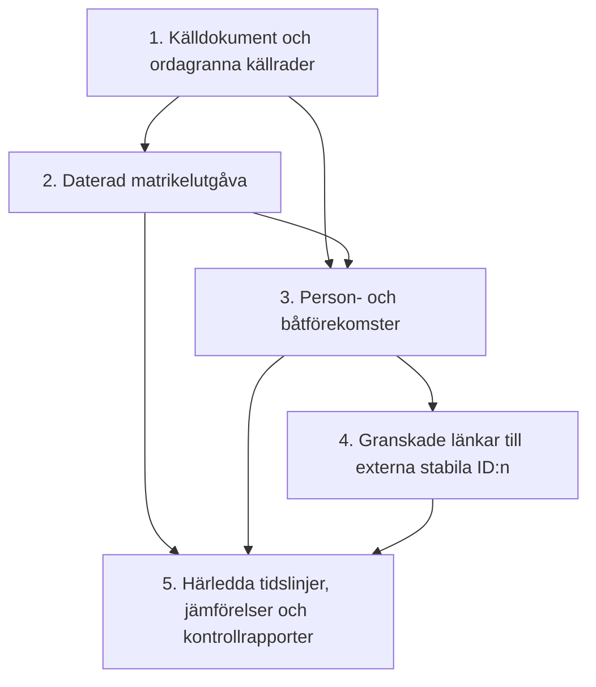
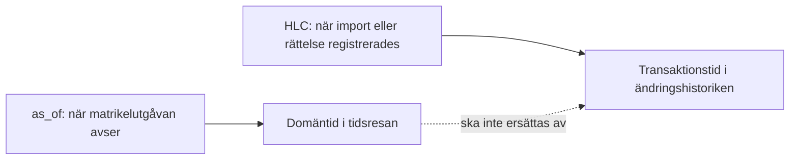
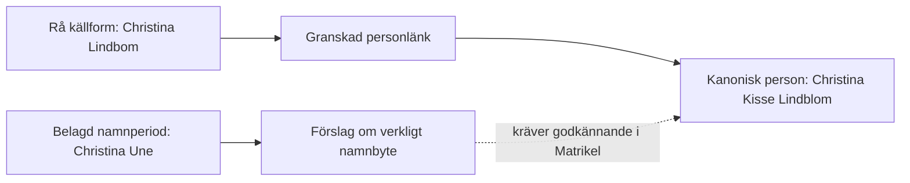
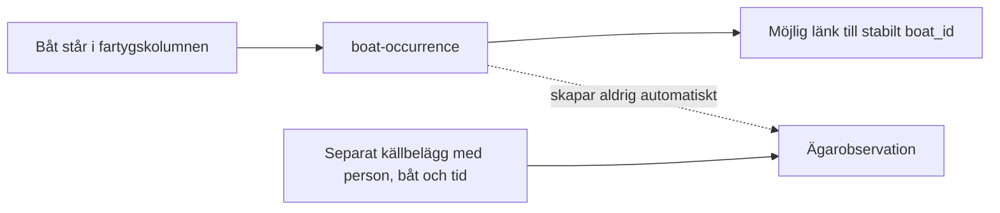
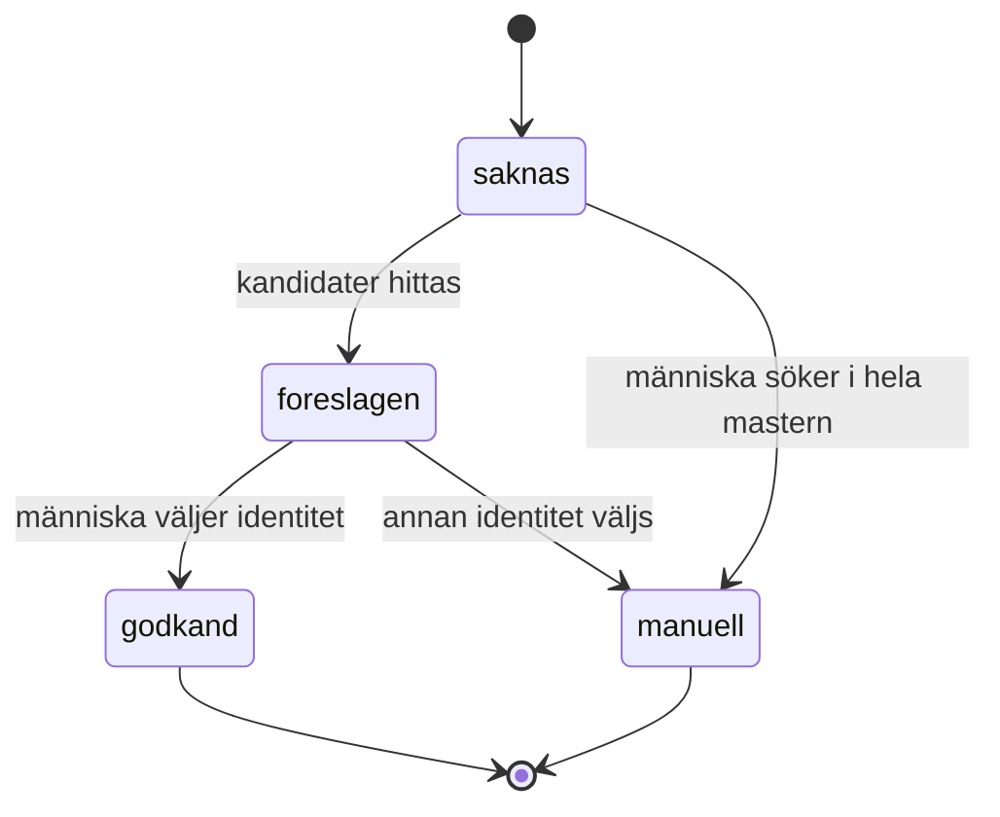
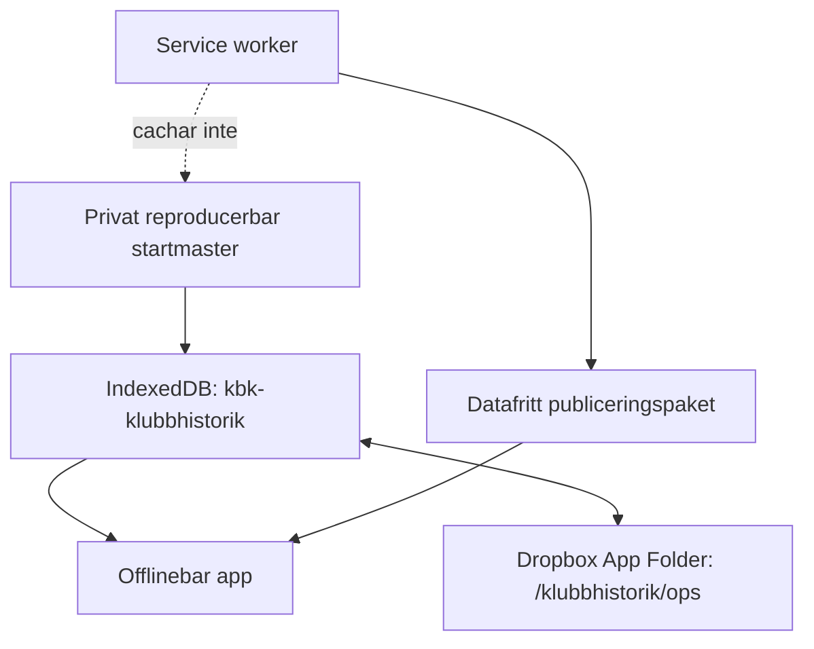

# Arkitektur för Klubbhistorik

Klubbhistorik är den tidsbundna observationsmastern för Korpholmens
Båtklubb. Appen bevarar vad en daterad klubbutgåva faktiskt säger och kopplar
det försiktigt till stabila personer och båtar. Den gemensamma
ansvarsfördelningen finns i [`../../ARKITEKTUR.md`](../../ARKITEKTUR.md).

## Avgränsning

Klubbhistorik ska kunna svara på frågor som:

- vilka personer och båtar förekommer i en viss matrikelutgåva?
- när går en person från junior till aktiv eller passiv medlem, om källorna
  faktiskt anger det?
- vilka riktiga namnbyten, klubbroller och klubbnamn är belagda över tid?
- vilka båtar förekommer under olika år, och när finns ett självständigt
  belägg för ägare eller brukare?

Appen ska inte avgöra släktskap, stabil personidentitet, stabil båtidentitet
eller fastighetsägande. Det gör respektive ägarapp.

## Modellens fem lager

### 1. Källan

`source-document` identifierar den privata källkopian, källtyp och SHA-256.
`source-row` bevarar ordalydelse, ordning och pekare till de förekomster som
tolkats ur raden. Råtext ändras aldrig när tolkningen rättas.

### 2. Utgåvan

`matrikel-release` beskriver den konceptuella klubbögonblicksbilden, exempelvis
»Medlemsmatrikel juli 1986«. Flera skanningar, sorteringar eller exportformat
kan senare höra till samma utgåva utan att bli olika historiska år.

### 3. Förekomsten

`person-occurrence` och `boat-occurrence` betyder att något står i källan.
Förekomsten bär råform, källordning, utgåva och eventuell normaliserad
tolkning. Den är inte samma sak som den stabila personen eller båten.

### 4. Identitetslänken

`person_id` respektive `boat_id` är länkar till Matrikel och Båtregister.
`person-ref` och `boat-ref` är privata referenssnapshots för sökning och
visning. De är utbytbara kataloger, inte egna mastrar. En `boat-ref` bär en
fullständig strukturerad ögonblicksbild av båtpostens metadata, men inte
bildfilerna. Granskningsvyn kan därför alltid visa särskiljning, typ, modell,
år, period, ägare, namnhistorik och källor utan att göra Klubbhistorik till
båtmaster.

### 5. Den härledda vyn

Tidslinjer, skillnadslistor, personprofiler och namnbytesförslag räknas ur de
fyra föregående lagren. En omräkning får förändra presentationen men aldrig
råkällan eller skapa ett nytt bekräftat faktum.

## Två tidsaxlar

Pilotens `as_of` är 1980, 1986 och 2025. En identitetskoppling som görs 2026
ändrar inte när källobservationen gällde. På motsvarande sätt är en matrikel
inte bevis för exakt inträdes- eller utträdesdag om den bara visar ett
ögonblick.

## Namn: källform, identitet och verklig förändring

- Källformen visas ordagrant även när den innehåller ett skriv- eller OCR-fel.
- En identitetslänk säger vem raden avser, inte att varje bokstav är korrekt.
- Rena stavningsskillnader blir inte namnbyten.
- Ett verkligt namnbyte kan lagras som `name-change-candidate` i
  Klubbhistorik, men `writes_to_person_master` är `false` tills uppgiften har
  prövats i Matrikel.
- Historiska klubbnamn behandlas likadant: ordagrann form i förekomsten,
  avsiktlig och kanonisk klubbnamnshistorik i Matrikel efter granskning.

## Båtar och ägande

I 1980 och 1986 års blad är medlems- och fartygskolumnerna inte tillräckligt
radparade för att bära ägande. Därför gäller:

En framtida `ownership-observation` måste minst bära person-ID, båt-ID,
domäntid eller intervall, källrad/evidens, roll (`ägare`, `brukare`,
`familjebåt` eller annan tydlig betydelse), säkerhet och granskningsstatus.
Först då kan Explorer visa vem som ägde eller använde båten vid en viss tid.

En fartygsrad kan innehålla flera kommaseparerade namn. Raden bevaras då som
en `source-row`, medan varje namn blir en egen `boat-occurrence`; en förekomst
får länka till högst en fysisk båt. Retrospektiva särskiljningar ändrar inte
källformen. Exempelvis bevaras matrikelns »Filifjonkan« ordagrant men länkas
efter granskning till båten Filifjonkan I, medan Filifjonkan II är en annan
fysisk båt med ett eget stabilt ID.

När flera fysiska båtar har samma namn får urvalslistan aldrig visa bara
namnet. Den visar även Båtregistrets särskiljning och matchningsmetadata, till
exempel »Majsol — Neretnieks · S/S · 1975« respektive »Majsol — Holm · M/S ·
2013«. Redan godkända manuella kopplingar ligger kvar i en efterkontroll där
de kan ändras med en ny operation; det tidigare beslutet raderas inte.

## Matchnings- och granskningsflöde

Den nuvarande importen använder även `kopplad` för en entydig, tillåten
maskinell träff. Osäkra kandidater får aldrig märkas som bekräftade bara för
att en algoritm har rankat dem först. Dubblettrader och ogiltiga rådatum ligger
kvar som egna kontrollpunkter.

## Lagring och synk

Startmastern aktiveras bara från källappen på localhost. Den publika appen
innehåller varken råa matrikelrader, personreferenser eller båtreferenser.
Första uppladdningen delas i oföränderliga operationsbatcher. Senare beslut
läggs till som nya operationer och synkas i den egna namnrymden.

## Nu byggt och senare utbyggnad

| Område | Status |
|---|---|
| Utgåvorna 1980, 1986 och 2025 | Byggt |
| Ordagranna person- och båtrader | Byggt |
| Person- och båtreferenser med granskningskö | Byggt |
| Källvy, normaliserad vy, tidsjämförelse och personhistorik | Byggt |
| Verkliga namnbyteskandidater utan återskrivning | Byggt |
| Medlemsroller utöver källans befintliga status | Planerat när nya matriklar ger stöd |
| Källbelagda ägar- och brukarobservationer | Planerat; aldrig genom radparning |
| Fastighets-/öobservationer över tid | Planerat efter strukturerad fastighetskälla |
| Gemensam Explorer-tidsmaskin | Planerad skrivskyddad läsprojektion |

## Ritual när en ny matrikel tillkommer

1. Kopiera originalet bytebevarat och registrera kontrollsumma och proveniens.
2. Skapa eller återanvänd rätt `matrikel-release`.
3. Importera varje synlig källrad, även tomnoter, dubbletter och svårtolkade
   värden som annars skulle kunna falla bort.
4. Skapa förekomster utan att ändra källtexten.
5. Matcha bara entydiga fall automatiskt; lägg resten i granskningskö.
6. Jämför radantal, kontrollpunkter och operationshash i test.
7. Låt nya namn-, roll-, ägar- eller fastighetsfynd bli förslag till rätt
   ägarapp, aldrig direkta återskrivningar.
8. Bygg och läckagekontrollera det datafria publiceringspaketet.

Den konkreta entitetslistan finns i [`DATAMODELL.md`](DATAMODELL.md), och
säkerhetskontrakten samt kommandona finns i [`README.md`](README.md).
